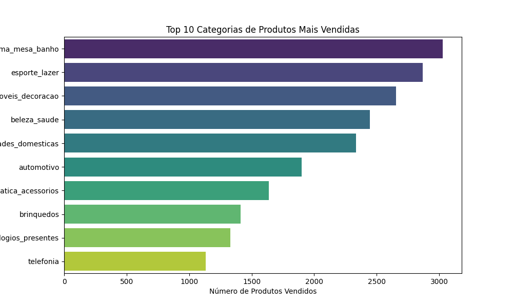
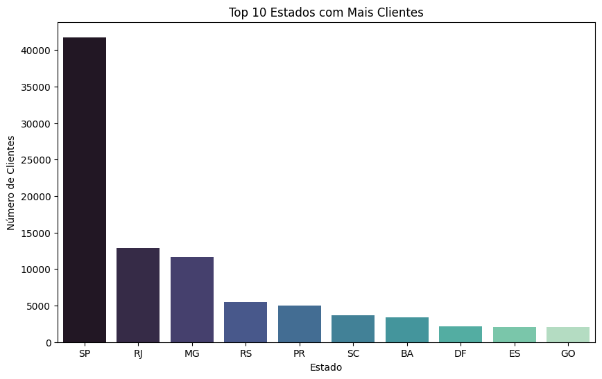

# Análise de Vendas de E-commerce Brasileiro

Projeto de análise de dados realizado como parte do meu portfólio pessoal, focado em extrair insights de um grande conjunto de dados de um e-commerce no Brasil.

## 🎯 Objetivo

O principal objetivo deste projeto foi analisar os dados de mais de 100.000 pedidos para responder a perguntas de negócio chave, como:
- Quais são as categorias de produtos mais vendidas?
- De quais estados vêm a maioria dos clientes?
- Qual é o ticket médio (valor médio) por pedido?

## 🛠️ Ferramentas Utilizadas
- **Linguagem:** Python
- **Bibliotecas:** Pandas (para manipulação de dados), Matplotlib e Seaborn (para visualização de dados).
- **Ambiente:** Google Colab

## 📊 Principais Descobertas

### 1. Top 10 Categorias de Produtos
A análise revelou que as categorias relacionadas a casa e bem-estar dominam as vendas.

### 2. Distribuição de Clientes por Estado
A grande maioria dos clientes está concentrada na região Sudeste, com São Paulo liderando de forma expressiva.

### 3. Ticket Médio por Pedido
O valor médio gasto por pedido na loja é de **R$ 154,05**. Esta é uma métrica vital para o planejamento financeiro e estratégias de marketing.

## 🔗 Conclusão
Este projeto demonstrou na prática como a análise de dados pode fornecer insights valiosos para um negócio, desde a gestão de estoque (focando nas categorias mais populares) até estratégias de marketing regionalizadas.
